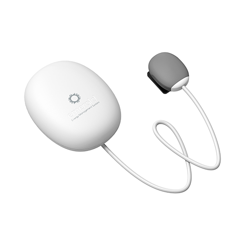
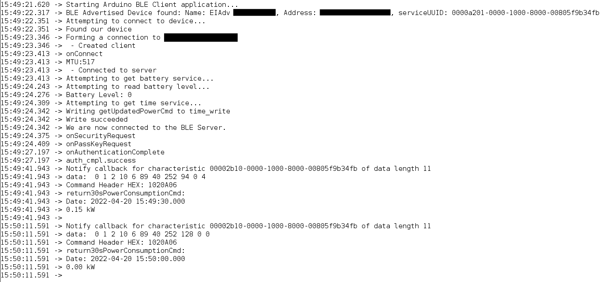
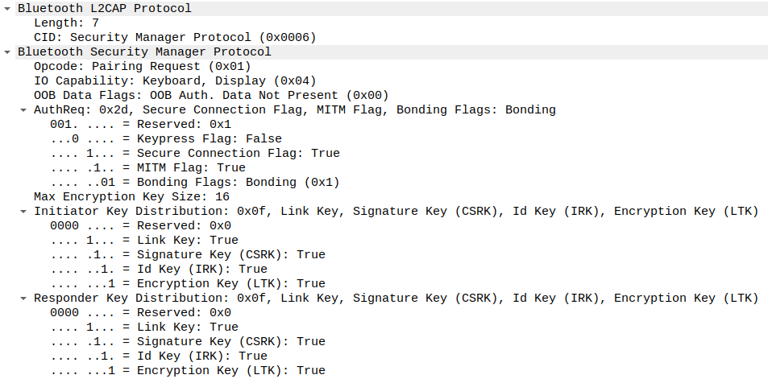

_This repository is not affiliated with Emerald._

# emerald_electricity_advisor
Collection of code, tools and documentation for data retrieval from your Emerald Electricity Advisor (all reverse engineered)



- [Using the ESPHome Component](#using-the-esphome-component)
- [Using the Arduino sketch](#using-the-arduino-sketch)
- [Using the Emerald API](#using-the-emerald-api)
- [BLE Documentation](#ble-documentation)

## Using the ESPHome Component

The ESPHome component hasn't been merged into esphome yet, but you can use it via `external_components`

#### Requirements:
- An ESP32
- A configured Emerald Electricity Advisor
- Electricity Advisor device information:
  - BLE MAC address (can be found on device sticker, by running sketch, or by using an app like nRF Connect)
  - Connection pairing pin (6 digits you input when setting up your device, also can be found on device sticker (last 6 digits of serial))
  - Your Smart meter pulse rate (eg. 1000 pulses = 1kW/h)

```yaml
external_components:
  - source: github://WeekendWarrior1/esphome@emerald_ble
    # requires ble_client and ble_tracker because I had to add some small features to authenticate properly
    components: [ ble_client, esp32_ble_tracker, emerald_ble ]

esp32_ble_tracker:

ble_client:
  - mac_address: 30:1B:97:01:02:03
    id: emerald_advisor

sensor:
  - platform: emerald_ble
    ble_client_id: emerald_advisor
    power:
      name: "Emerald Power"
    energy:
      name: "Emerald Total Energy"
    battery_level:
      name: "Emerald Battery"
    pairing_code: 123123
    pulses_per_kWh: 1000
```
You can also find a full config here: [emerald_ble.yaml](emerald_ble.yaml)

And the component code here: [emerald_ble ESPHome Component](https://github.com/WeekendWarrior1/esphome/tree/emerald_ble/esphome/components/emerald_ble)

## Using the Arduino sketch
This sketch simply prints the energy usage and time stamp for the updates sent by the Electricity Advisor, which should be received every 30s.

It's mainly useful to demonstrate that the Electricity Advisor is connectable by a third party device.

Of interest in the sketch is the security configuration required to pair/handshake with the Electricity Advisor, which may limit what BLE technologies, libraries and languages you can use to connect (not every library seems to support secure BLE connections)

#### Requirements:
- An ESP32
- A configured Emerald Electricity Advisor
- Electricity Advisor device information:
  - BLE MAC address (can be found on device sticker, by running sketch, or by using an app like nRF Connect)
  - Connection pairing pin (6 digits you input when setting up your device, also can be found on device sticker (last 6 digits of serial))
  - Your Smart meter pulse rate (eg. 1000 pulses = 1kW/h)


#### Fill in your details at top of esp32_ble_print_data.ino and upload:
```c++
static char *BLE_address("30:1b:97:00:00:00"); // lowercase only or else will fail to match
// if your pairing pin starts with 0, eg "024024", set the emerald_pass_key as 24024
static uint32_t emerald_pass_key = 123123;
static float pulses_per_kw = 1000;
```

#### Serial Monitor output:


## Using the Emerald API
If you would prefer to use the cloud api rather than retrieving real-time data from the Electricity Advisor, please head to [api_documentation](api_documentation.md) to learn how to authenticate and retrieve energy data.

Feel free to import the postman collection if you would like to have a play or to investigate the data you can retrieve:

`Import` (ctrl+o in postman), > `link` > `Enter a URL` `https://raw.githubusercontent.com/WeekendWarrior1/emerald_electricity_advisor/main/emerald-ems.postman_collection.json` > `Continue`

## BLE Documentation

#### Important BLE services
```js
TIME_SERVICE_UUID: "00001910-0000-1000-8000-00805f9b34fb"
    // Subscribe to notifications on this characteristic for all the Emerald energy information. Data comes back with a descriptive 5 byte command header
    READ_CHAR_UUID: "00002b10-0000-1000-8000-00805f9b34fb"

    // Write commands to this characteristic to change Emerald Advisor settings or retrieve energy data
    WRITE_CHAR_UUID: "00002b11-0000-1000-8000-00805f9b34fb"
```

#### Important Emerald Command Headers
```js
getImpulseCmd =                              "0001010500";
getPairingCodeCmd =                          "0001030100";
getEvery30sPowerConsumptionCmd =             "0001020306";
getDeviceTimeCmd =                           "0001010200";
getUpdatedPowerCmd =                         "0001020100";
getEvery30sPowerConsumptionCmdWitninHours =  "0001021308";


// Set pulses_per_kwh, with 2 bytes after the command
// eg. 000101040203E8 <- (1000 in hex = 03E8)
setImpulseCmd =                              "0001010402";
startGettingHistoryCmd =                     "0001020400";
endGettingHistoryCmd =                       "0001020600";
setDeviceTimeCmd =                           "0001010104";
resetCmd =                                   "0001010a00";
// Enable automatic upload of pulses (every 30s)
// eg. 0001020b0101 <- (true in hex = 01)
setAutoUploadStatusCmd =                     "0001020b01";


return30sPowerConsumptionCmd =               "0001020a06";
returnUpdatedPowerCmd =                      "0001020204";
returnEvery30sPowerConsumptionCmd =          "000102050e";
returnImpulseCmd =                           "0001010602";
returnPairingCodeCmd =                       "0001030206";
returnDeviceTimeCmd =                        "0001010304";
```

#### Connecting to an Emerald Electricity Advisor over BLE

The Emerald has reasonably strict authentication requirements:



On an ESP32 I needed to set:
```c++
esp_ble_io_cap_t iocap = ESP_IO_CAP_KBDISP;
esp_ble_gap_set_security_param(ESP_BLE_SM_IOCAP_MODE, &iocap, sizeof(esp_ble_io_cap_t));

uint8_t key_size = 16;
esp_ble_gap_set_security_param(ESP_BLE_SM_MAX_KEY_SIZE, &key_size, sizeof(uint8_t));

esp_ble_auth_req_t auth_req = ESP_LE_AUTH_REQ_SC_MITM_BOND;
esp_ble_gap_set_security_param(ESP_BLE_SM_AUTHEN_REQ_MODE, &auth_req, sizeof(esp_ble_auth_req_t));
```

After connecting, the Emerald Advisor will request the passkey from your device, which will depend on your BLE library how you respond:
```c++
// arduino callback
class MySecurityCallback : public BLESecurityCallbacks
{
    bool onSecurityRequest() {
        return true;    // Return true if we accept this peer device auth request
    }
    uint32_t onPassKeyRequest() {
        return 123123;
    }
}

// esp-idf
switch (event) {
  case ESP_GAP_BLE_SEC_REQ_EVT: // Return true if we accept this peer device auth request
    esp_ble_gap_security_rsp(param->ble_security.ble_req.bd_addr, true);
    break;
  case ESP_GAP_BLE_PASSKEY_REQ_EVT: /* passkey request event */
    esp_ble_passkey_reply(param->ble_security.ble_req.bd_addr, true, 123123);
    break;
}
```
Authentication is now complete, so time to enable `setAutoUploadStatusCmd`:
```c++
uint8_t enable_auto_upload[] = {0x00, 0x01, 0x02, 0x0b, 0x01, 0x01};
pRemoteCharacteristic_readingbatchsize->writeValue(enable_auto_upload, sizeof(enable_auto_upload), false);
```

Subscribe to Emerald Advisor notifications:
```c++
pRemoteCharacteristic_time_read = pRemoteService_time->getCharacteristic(CHAR_TIME_READ_UUID);
pRemoteCharacteristic_time_read->registerForNotify(emeraldCommandCallback);
```

Parse incoming Emerald Advisor notifications:
```c++
// incoming data
// pData = [0 1 2 10 6 89 55 105 158 0 12]
// first 5 bytes (0-4) are the Emerald Command Header, which describes the data
uint32_t commandHeader = 0;
for (int i = 0;  i < 5; i++) {
    commandHeader += (pData[i] << (8*(4-i)));
}

// pData [0 1 2 10 6] = 0001020a06, command header return30sPowerConsumptionCmd

// next 4 bytes (5-8) are an oddly formatted timestamp (I'm guessing either for obfuscation or to avoid the Year 2038 unix-timestamp problem)
uint32_t commandDateBin = 0;
for (int i = 5;  i < 9; i++) {
    commandDateBin += (pData[i] << (8*(8-i)));
}
// (6 bits)year + (4 bits)month + (5 bits)days + (5 bits)hours(locale adjusted) + (6 bits)minutes + (6 bits)seconds
uint16_t year = 2000 + (commandDateBin >> 26);  // need to add 2000 to get the correct year
uint8_t month = ((commandDateBin >> 22) & 0b1111);  // month number between 1 - 12
uint8_t days = ((commandDateBin >> 17) & 0b11111); // 1-31
uint8_t hours = ((commandDateBin >> 12) & 0b11111); // 0-23
uint8_t minutes = ((commandDateBin >> 6) & 0b111111); // 0 -59
uint8_t seconds = commandDateBin & 0b111111; // 0 -59

// last 2 bytes (9+10) are the pulses within the time interval window (30s)
uint16_t pulses_within_interval = data[9] << 8;
pulses_within_interval += + data[10];
```